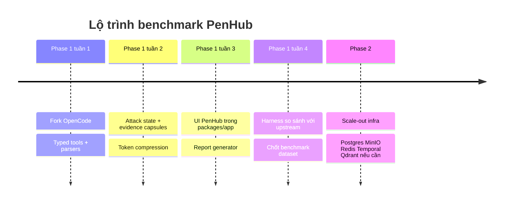
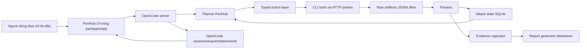

# Báo cáo triển khai PenHub trên nền OpenCode

## Tóm tắt điều hành

**PenHub** nên được xây như một **fork của OpenCode**, không phải một “hệ thống mới bao quanh OpenCode”. Lý do là OpenCode đã có sẵn các điểm gắn quan trọng để biến agent coding thành agent CTF/pentest có trạng thái: HTTP server với OpenAPI 3.1, web UI chạy song song với session, custom tools có schema kiểu Zod và còn có thể **override built-in tools**, cùng CLI để lấy **session**, **stats**, **export JSON** và truy vấn **db**. Repo hiện cũng đã có sẵn các package cho `app`, `server`, `core`, và thậm chí các package SQLite/Drizzle ngay trong monorepo, nên đường đi ROI cao nhất là **thay đổi cách agent suy nghĩ và gọi công cụ bên trong OpenCode**, thay vì lắp thêm một tầng middleware lớn. citeturn45view0turn46view0turn43view0turn44view1turn44view2turn49view0turn51view0turn51view1turn51view2

Điểm khác biệt cốt lõi của PenHub so với upstream OpenCode là:

1. **Typed action layer cho CTF/pentest**: agent không gọi `bash` tự do làm mặc định, mà ưu tiên một lớp action có kiểu dữ liệu rõ ràng như `http_probe`, `dir_fuzz`, `vuln_scan`, `api_fuzz`, `state_update`, `evidence_capture`, `report_generate`. OpenCode đã hỗ trợ custom tool theo file `.ts/.js`, có schema, context session và có thể override built-in tool nếu muốn. citeturn46view0

2. **Attack-state memory nén theo cấu trúc**: thay vì nhồi toàn bộ stdout dài vào prompt, PenHub lưu raw artifact ra file/JSONL, parser hoá thành fact nhỏ và cho model chỉ nhìn thấy “tình hình chiến dịch” đã nén. Điều này phù hợp với thực tế benchmark cyber multi-step: CAIBench cho thấy hiệu năng phụ thuộc mạnh vào **framework scaffolding** và cách tổ chức agent, với bootstrap đúng có thể tạo chênh lệch tới **2.6×** trong Attack & Defense CTF; AIRTBench cũng cho thấy frontier model mạnh nhưng vẫn rơi rõ ở các bài đòi hỏi khai thác hệ thống nhiều bước, không chỉ trả lời tri thức. citeturn47academia1turn47academia0

3. **Evidence-first reporting**: mọi hành động ra artifact, artifact ra evidence capsule, evidence capsule ra báo cáo Markdown replayable. OpenCode đã có `export` session JSON, `stats`, `share`, `summarize`, và web session management; PenHub chỉ cần buộc các dữ kiện pentest đi qua cấu trúc đó thay vì để transcript tự do. citeturn44view1turn44view2turn43view0turn45view0

4. **Benchmark tự động so với upstream OpenCode**: mục tiêu Phase 1 không phải “thêm nhiều thành phần infra”, mà là chứng minh một tập bài CTF/pentest mà `OpenCode + GPT-5.5` không giải được hoặc giải kém, còn `PenHub + GPT-5.5` giải được, tốn ít token hơn, và sinh được báo cáo tốt hơn. Pentest-R1, CAIBench và AIRTBench đều chỉ ra rằng với cùng model, **training/scaffolding/feedback loop** có thể thay đổi kết quả đáng kể. citeturn47academia2turn47academia1turn47academia0

Kết luận thực thi: **Phase 1 chỉ dùng OpenCode fork + SQLite hiện có + JSONL artifact + Docker Compose + UI mới trong `packages/app` + parser/action layer trong `packages/core` và `packages/server`**. **Không dùng Redis, Qdrant, Temporal, MinIO trong runtime Phase 1**. Chúng chỉ nên xuất hiện ở Phase 2, khi benchmark chứng minh bottleneck thật sự là phân tán, queue bền, object store, hay retrieval ở quy mô lớn. SQLite phù hợp cho local embedded state ít vận hành; DuckDB chỉ nên dùng cho **offline benchmark analytics**, không chèn vào execution path của agent. Dense/vector retrieval cũng **không phải ưu tiên Phase 1**: DPR có thể hơn BM25 9–19 điểm top-20 trên open-domain QA trong bối cảnh phù hợp, nhưng BEIR cho thấy BM25 vẫn là baseline zero-shot rất mạnh và dense retrieval thường hụt dưới domain shift; vì vậy vector DB chỉ nên thêm khi PenHub có corpus artifact/tri thức đủ lớn và benchmark retrieval thật sự hụt. citeturn23view1turn24view1turn24view2turn25academia2turn25academia0

## Mục tiêu và benchmark

### Mục tiêu sản phẩm

Mục tiêu của PenHub là biến OpenCode thành một agent **tự giải CTF/pentest end-to-end** với ít can thiệp của người hơn, bằng cách đổi từ “chat + bash” sang “planner + typed tools + attack state + evidence + report”. OpenCode vốn đã support tương tác lập trình qua CLI, web, HTTP server, sessions, messages, commands, files, tools và events; vì vậy PenHub không cần dựng thêm control-plane riêng ở Phase 1. citeturn43view0turn43view1turn45view0

### Thiết kế benchmark

Benchmark nên là một tập **20–30 task nội bộ** chia thành bốn nhóm:

- **Web recon & content discovery**
- **Vulnerability validation**
- **Stateful/API exploitation**
- **Capture/reporting**

Thiết kế này bám theo nhận định của CAIBench rằng benchmark cyber hữu ích phải đo được **khả năng tích hợp đa bước**, không chỉ tri thức đơn lẻ; của AIRTBench rằng black-box CTF thực tế đo tốt hơn khả năng agent tự viết mã, tự tương tác mục tiêu; và của Pentest-R1 rằng hiệu năng pentest agent nên được đo trên task có feedback môi trường thật như Cybench/AutoPenBench thay vì chỉ trả lời câu hỏi. citeturn47academia1turn47academia0turn47academia2

### Chuẩn so sánh bắt buộc

Mỗi task chạy ít nhất trên hai cấu hình:

- **Baseline**: upstream OpenCode + GPT-5.5
- **PenHub**: PenHub fork + GPT-5.5

Phải cố định:
- cùng model,
- cùng max wall-time,
- cùng token ceiling,
- cùng target,
- cùng tool allowlist tối thiểu,
- cùng số lần lặp.

CAIBench cho thấy riêng “framework scaffolding + model pairing” đã có thể tạo chênh lệch lớn, nên nếu không khóa điều kiện chạy thì benchmark sẽ không có giá trị quy kết. citeturn47academia1

### Metrics cần thu

| Metric | Ý nghĩa | Vì sao quan trọng |
|---|---|---|
| `solve_rate` | Tỷ lệ hoàn thành task/flag/goal | KPI chính |
| `time_to_first_valid_evidence` | Thời gian đến bằng chứng đầu tiên đáng tin | Đo tốc độ định hướng |
| `tokens_total` | Tổng token prompt + completion | Đo hiệu quả chi phí |
| `actions_total` | Số hành động typed tool / shell | Đo hiệu suất plan |
| `tool_error_recovery_rate` | Tỷ lệ phục hồi sau lỗi tool | Đo độ bền của loop |
| `evidence_density` | Số evidence capsule hợp lệ / 1000 token | Đo chất lượng quan sát |
| `report_completeness` | Có scope, steps, findings, replay, limitations | Đo giá trị bàn giao |
| `unsafe_or_out_of_scope_attempts` | Lần agent đi lạc hoặc làm thừa | Đo tiết kiệm human effort |

Việc theo dõi token và cost có thể tận dụng ngay `opencode stats`; việc lưu transcript replayable có thể tận dụng `opencode export`; việc so sánh session có thể đi qua API session/message/status của server. citeturn44view2turn44view1turn45view0

### Tiêu chí thành công Phase 1

PenHub chỉ nên được coi là thành công khi đạt đồng thời cả ba điều kiện:

- `solve_rate` cao hơn upstream trên tập benchmark mục tiêu,
- `tokens_total` trung vị giảm hoặc không tăng đáng kể,
- `report_completeness` tăng rõ rệt.

Nếu chỉ solve-rate tăng nhưng token/cost và effort kiểm duyệt tăng mạnh, thì đó chưa phải đường đi ROI cao nhất. Điều này phù hợp với kết luận từ AIRTBench và CAIBench rằng benchmark agent cyber cần nhìn cả **khả năng hoàn thành** lẫn **harness/scaffolding efficiency**, không chỉ accuracy thô. citeturn47academia0turn47academia1



## Kiến trúc và tech stack

### Kiến trúc tổng thể

Phase 1 nên bám sát các khối đã có của OpenCode:

- `packages/app`: giao diện web app; repo cho thấy app có `src`, `public`, `vite.config.ts`, `playwright.config.ts`, và README nhắc đến Solid app + build bằng Vite + E2E bằng Playwright. citeturn51view2
- `packages/server`: headless HTTP/OpenAPI server mà docs mô tả là điểm vào chính cho clients, sessions, messages, files, tools và events. citeturn45view0turn51view0
- `packages/core`: business logic và schema/runtime; repo cho thấy package này có `src`, `test`, `drizzle.config.ts`, `schema.json`. citeturn51view1
- SQLite path và DB hiện có của OpenCode: docs CLI có `opencode db`, `opencode db path`, và repo có package `effect-drizzle-sqlite`, `effect-sqlite-node`, chứng minh SQLite đã là phần tự nhiên của stack. citeturn44view3turn49view0



### Stack được chốt cho Phase 1

#### OpenCode fork

**Chọn** vì đây là nền tảng execution/interface tốt nhất với chi phí thay đổi thấp nhất:

- Có web app chạy cùng session với terminal/TUI. citeturn43view0
- Có server OpenAPI 3.1, sessions, message, file, command, tool APIs. citeturn45view0
- Có custom tools kiểu mạnh, context-aware, override built-ins được nếu cần. citeturn46view0
- Có `stats`, `export`, `session`, `db` để benchmark và replay. citeturn44view1turn44view2turn44view3

**Hạn chế:** không phải framework chuyên cyber; vì vậy PenHub phải thêm typed actions, evidence pipeline và attack-state riêng.

#### SQLite

**Vai trò Phase 1:** nguồn sự thật cho attack state, plan state, evidence index, benchmark run metadata.

**Bằng chứng chọn:**
SQLite nhắm vào local embedded storage, nhấn mạnh economy, efficiency, reliability, independence và simplicity thay vì shared enterprise repository; ngoài ra còn phù hợp cho cache local và server-side application-specific database. Điều này rất đúng với PenHub Phase 1, nơi state chủ yếu là local, bounded, single-run hoặc few concurrent runs. citeturn23view1

**Quyết định:** tái sử dụng DB hiện có của OpenCode, mở rộng schema trong `packages/core`, không dựng thêm PostgreSQL ở Phase 1. Repo đã cho thấy OpenCode có package SQLite/Drizzle sẵn. citeturn49view0turn51view1

**Hạn chế:** khi concurrency, centralization và control tăng, SQLite không còn là fit tối ưu so với client/server RDBMS. citeturn23view1

#### JSONL artifact store

**Vai trò Phase 1:** lưu raw stdout, HTTP bodies, ffuf/nuclei outputs, parser trace, screenshots/text blobs, benchmark event log.

**Lý do:** JSONL append-friendly, đơn giản để diff/replay, hợp với stream sự kiện theo bước. Đây là quyết định kỹ thuật nội bộ; lợi thế chính là tách artifact thô ra khỏi prompt và ra khỏi schema transaction. Quyết định này là suy luận thiết kế từ việc OpenCode hỗ trợ export JSON session, event/SSE và file access. citeturn45view0turn44view1

#### DuckDB

**Vai trò Phase 1:** **offline analytics** cho benchmark, không ở execution path.

**Bằng chứng chọn:**
DuckDB là embedded/in-process analytical DBMS cho OLAP, dùng columnar-vectorized execution; docs của DuckDB nêu rõ đây là lợi thế cho analytical query workloads và cho phép xử lý nhanh các workload scan/join/aggregate mà không cần server riêng. citeturn24view1turn24view2

**Quyết định:** dùng DuckDB để phân tích JSONL benchmark runs, tokens, step traces, error classes và compare upstream-vs-PenHub. Không dùng DuckDB làm state store trực tiếp cho agent loop.

**Hạn chế:** DuckDB không nhắm vào OLTP/session state như SQLite/Postgres. citeturn24view2

#### Solid + Vite + Playwright trong `packages/app`

Repo `packages/app` cho thấy UI hiện tại là app có `vite.config.ts`, `playwright.config.ts`, `src`, `public`, và README mô tả build Vite, app Solid, cùng E2E Playwright. Điều này làm Phase 1 UI rất rõ đường cắm: sửa trực tiếp `packages/app/src`, thêm page/panel PenHub và E2E vào Playwright. citeturn51view2

#### Typed custom tools của OpenCode

OpenCode custom tools được định nghĩa bằng TypeScript/JavaScript, có schema kiểu Zod, có context session/worktree/directory, và có thể override built-ins như `bash`. Đây là cơ chế tốt nhất để tạo “hành động pentest typed” mà không phải dựng một agent framework khác. citeturn46view0

#### CLI-native pentest actions

Phase 1 chỉ nên dùng **CLI-native** wrappers, không dùng GUI. Với các tool có output cấu trúc, đây là điểm cộng lớn:
- `ffuf` hỗ trợ `-of json` và `-json` newline-delimited JSON. citeturn20view0turn20view1
- `nuclei` hỗ trợ `-jsonl`, `-json-export`, `-jsonl-export`. citeturn17view0turn17view2turn17view3

Điều này cho phép parser-first design thay vì nhét text thô vào model.

#### Tree-sitter + ripgrep

Nếu cần code-CTF, source auditing hoặc target repository reasoning, Tree-sitter cho incremental parsing, robust ngay cả khi source có lỗi cú pháp; ripgrep là line-oriented recursive search, mặc định tôn trọng `.gitignore` và có benchmark cho thấy nhanh trên code search. Đây là cặp ROI cao cho code-oriented recon trong repo hoặc source artifact. citeturn41view0turn42view1turn42view2

### Vì sao chưa dùng vector DB ở Phase 1

Không nên thêm Qdrant/vector DB ở Phase 1 chỉ vì “RAG nghe hay”. Bằng chứng hiện có không ủng hộ việc vector retrieval luôn thắng:

- DPR cho thấy dense retrieval có thể hơn BM25 **9–19 điểm tuyệt đối ở top-20 passage retrieval** trong open-domain QA in-domain phù hợp. citeturn25academia2
- Nhưng BEIR cho thấy dưới zero-shot heterogeneous retrieval, **BM25 vẫn là baseline rất mạnh**, dense/sparse retrieval thường hụt tính tổng quát hơn reranking/late interaction. citeturn25academia0

**Kết luận kỹ thuật:**  
Phase 1 chỉ dùng:
- file artifacts,
- SQLite state,
- keyword/path retrieval trong workspace,
- parser summaries.

Qdrant chỉ nên vào Phase 2 khi benchmark cho thấy PenHub thất bại vì **không tìm lại được** evidence/notes/chunks trong corpus lớn. Nếu Phase 2 cần, Qdrant có ưu điểm native hybrid dense+sparse, metadata filters và one-stage filtering. citeturn26view0

### Vì sao chưa dùng Redis, Temporal, MinIO ở Phase 1

- **Redis** mạnh cho sub-millisecond caching, rate limiting, pub/sub, queues; nhưng docs chính Redis cũng cho thấy giá trị của nó phát huy khi có distributed services, request-path quota, ephemeral messaging hoặc lock phân tán. Phase 1 của PenHub chưa cần những thứ đó nếu chạy local/single-node. citeturn28view0turn29view2turn29view3turn28view1turn29view0
- **Temporal** mạnh khi có workflow dài, crash-proof, resume xuyên outage; đó là case của scale-out multi-worker hơn là single-node fork ban đầu. citeturn27view3
- **MinIO** là object store S3-compatible hiệu năng cao cho AI/analytics; rất hợp khi evidence/artifacts lớn và cần chia sẻ hoặc lưu lâu dài ở cụm, nhưng quá mức cho Phase 1 local. citeturn31view0turn31view1

### Bảng so sánh stack theo phase

| Thành phần | Phase 1 | Phase 2 | Lý do chốt |
|---|---|---|---|
| Orchestrator/UI | OpenCode fork | OpenCode fork | Đã có server, web, session, tools |
| State store | SQLite hiện có | PostgreSQL | Bắt đầu local, lên client/server khi multi-user |
| Artifact store | JSONL + local files | MinIO | Chỉ scale object store khi artifact lớn |
| Analytics | DuckDB offline | DuckDB + warehouse tùy chọn | OLAP offline cho benchmark |
| Retrieval | path/keyword/parser summaries | Qdrant hybrid | Chỉ thêm khi corpus lớn gây miss retrieval |
| Queue/workflow | không dùng | Temporal | Chỉ cần khi chạy distributed durable workflows |
| Cache/rate limit | không dùng | Redis | Chỉ cần khi nhiều worker/users |

**Chứng cứ chốt Phase 1 tối giản:** repo OpenCode đã có sẵn `app`, `server`, `core`, package SQLite liên quan; docs có custom tools/server/web/CLI đầy đủ. Vì vậy xây “trong” OpenCode rẻ hơn và chắc hơn so với dựng một control-plane mới. citeturn49view0turn45view0turn46view0turn43view0turn44view1

## Kế hoạch triển khai Phase 1

### Danh sách task theo ROI

| Ưu tiên | Task | ROI | Effort |
|---|---|---|---|
| Rất cao | Typed action layer + output parsers | Rất cao | Medium |
| Rất cao | Attack-state + evidence capsule + token compression | Rất cao | Medium |
| Rất cao | Differential benchmark harness vs upstream OpenCode | Rất cao | Medium |
| Cao | UI PenHub trong `packages/app` | Cao | Medium |
| Cao | Report generator Markdown + replay steps | Cao | Low |
| Cao | API fuzz action cho OpenAPI targets | Cao | Medium |
| Trung bình | Policy/permission profiles và restricted shell | Trung bình | Low |
| Sau cùng | Scale-out infra Phase 2 | Điều kiện | High |

**Cơ sở nghiên cứu cho thứ tự trên:**  
CAIBench chỉ ra scaffolding/harness có thể thay đổi kết quả mạnh; Schemathesis cho thấy semantics-aware fuzzing từ API schema tìm được **1.4× đến 4.5×** defect unique so với fuzzer tốt thứ nhì trên từng target; foREST và MINER cho thấy thiết kế stateful/tree/data-driven giúp tăng coverage và lỗi phát hiện trong REST API fuzzing. Do đó ROI cao nhất là **đổi cách hành động và quan sát**, không phải đổi hạ tầng trước. citeturn47academia1turn35academia1turn35academia2turn36academia0

### Thay đổi mã nguồn đề xuất

Vì chưa duyệt hết từng file nội bộ của repo, các path dưới đây là **đích thêm mới hợp lý** theo cấu trúc monorepo hiện có; nếu tên file/router thực tế khác, Codex nên gắn vào các module tương đương trong `packages/core/src`, `packages/server/src`, `packages/app/src`. Repo chứng minh các package này tồn tại và là nơi thích hợp để cắm logic. citeturn51view1turn51view0turn51view2

#### Trong `packages/core/src`

Tạo mới:

```text
packages/core/src/penhub/
  attack-state.ts
  evidence.ts
  observation.ts
  planner.ts
  budget.ts
  contracts.ts
  parsers/
    ffuf.ts
    nuclei.ts
    http.ts
    generic-jsonl.ts
  report/
    markdown.ts
    replay.ts
  benchmark/
    metrics.ts
```

Chức năng:
- `attack-state.ts`: model trạng thái campaign
- `evidence.ts`: evidence capsule
- `observation.ts`: chuẩn hoá tool outputs
- `planner.ts`: chọn next action từ state
- `budget.ts`: quota token / observation / retries
- `contracts.ts`: schema Zod cho action/tool
- `parsers/*`: parser JSON/JSONL sang statefacts
- `report/*`: sinh báo cáo và replay steps
- `benchmark/*`: tính KPI

#### Trong `packages/server/src`

Tạo route hoặc service layer PenHub để UI và benchmark harness đọc/ghi state đã cấu trúc:

```text
packages/server/src/penhub/
  routes.ts
  service.ts
  persistence.ts
```

Các endpoint dự kiến:
- `GET /penhub/session/:id/state`
- `GET /penhub/session/:id/evidence`
- `POST /penhub/session/:id/action`
- `POST /penhub/session/:id/report`
- `GET /penhub/session/:id/budget`

Nếu muốn tối giản hơn nữa, Phase 1 có thể **không thêm route riêng**, chỉ dùng custom tools + session APIs sẵn của OpenCode; nhưng UI sẽ dễ làm hơn nếu có 3–5 endpoint đọc state đã parse. OpenCode server vốn đã public OpenAPI, sessions/messages/files/tools/events, nên việc thêm namespace `penhub/*` là mở rộng tự nhiên. citeturn45view0

#### Trong `packages/app/src`

Tạo feature UI PenHub:

```text
packages/app/src/features/penhub/
  pages/AttackWorkspace.tsx
  components/AttackGraph.tsx
  components/EvidencePanel.tsx
  components/BudgetPanel.tsx
  components/ActionComposer.tsx
  components/ReportPane.tsx
  components/FindingsTable.tsx
  hooks/usePenhubState.ts
  hooks/usePenhubEvents.ts
```

Repo cho thấy `packages/app` là web app có `src`, `public`, Vite và Playwright; do đó UI differentiation nên đi vào package này. citeturn51view2

#### Trong workspace tools

Tạo custom tools dùng ngay cho agent:

```text
.opencode/tools/
  penhub-http-probe.ts
  penhub-dir-fuzz.ts
  penhub-vuln-scan.ts
  penhub-api-fuzz.ts
  penhub-state-update.ts
  penhub-evidence-capture.ts
  penhub-report-generate.ts
  penhub-bash.ts
```

OpenCode custom tools cho phép định nghĩa args bằng `tool.schema`, truy cập `context.sessionID`, `context.directory`, `context.worktree`, và override built-ins khi cần. citeturn46view0

### Các bước thực thi chi tiết

#### Bước đầu tiên

Fork repo, cài dependencies, chạy app/server cục bộ:

```bash
bun install
bun run dev
opencode serve --port 4096
```

App package hiện có E2E Playwright và backend mặc định ở `localhost:4096`, nên đây cũng là đường chạy local hợp repo. citeturn51view2turn45view0

#### Dựng contract typed action trước

Action layer là thay đổi quan trọng nhất.

```ts
// packages/core/src/penhub/contracts.ts
import { z } from "zod"

export const TargetRef = z.object({
  kind: z.enum(["url", "host", "api"]),
  value: z.string(),
})

export const HttpProbeArgs = z.object({
  target: TargetRef,
  method: z.enum(["GET", "HEAD"]).default("GET"),
  path: z.string().default("/"),
  headers: z.record(z.string()).default({}),
  timeoutSec: z.number().int().min(1).max(30).default(10),
})

export const DirFuzzArgs = z.object({
  baseUrl: z.string().url(),
  wordlist: z.string(),
  extensions: z.array(z.string()).default([]),
  rate: z.number().int().min(1).max(200).default(50),
  timeoutSec: z.number().int().min(1).max(120).default(30),
})

export const VulnerabilityActionArgs = z.object({
  baseUrl: z.string().url(),
  templates: z.array(z.string()).default([]),
  severity: z.array(z.enum(["info", "low", "medium", "high", "critical"])).default(["medium","high","critical"]),
})

export const ApiFuzzArgs = z.object({
  schemaPath: z.string(),
  baseUrl: z.string().url(),
  maxExamples: z.number().int().min(1).max(1000).default(100),
})
```

#### Tạo custom tools

```ts
// .opencode/tools/penhub-dir-fuzz.ts
import { tool } from "@opencode-ai/plugin"
import { DirFuzzArgs } from "../../packages/core/src/penhub/contracts"
import { runFfufAndParse } from "../../packages/core/src/penhub/parsers/ffuf"

export default tool({
  description: "Run structured directory fuzzing and return compressed findings",
  args: DirFuzzArgs.shape,
  async execute(args, context) {
    const result = await runFfufAndParse({
      ...args,
      sessionID: context.sessionID,
      worktree: context.worktree,
    })
    return JSON.stringify(result)
  },
})
```

#### Parser-first cho ffuf và nuclei

Chỉ nhận JSON/JSONL, không parse text tự do nếu tránh được.

```ts
// packages/core/src/penhub/parsers/ffuf.ts
export async function runFfufAndParse(input: {
  baseUrl: string
  wordlist: string
  extensions: string[]
  rate: number
  timeoutSec: number
  sessionID: string
  worktree: string
}) {
  const outFile = `${input.worktree}/.penhub/artifacts/${input.sessionID}/ffuf.json`
  const ext = input.extensions.length ? `-e ${input.extensions.join(",")}` : ""
  const cmd = `ffuf -w ${input.wordlist} -u ${input.baseUrl.replace(/\/$/, "")}/FUZZ ${ext} -rate ${input.rate} -timeout ${input.timeoutSec} -of json -o ${outFile}`
  // chạy cmd, đọc JSON, nén top findings
  return {
    action: "dir_fuzz",
    outFile,
    summary: {
      total: 0,
      interesting: [],
    },
  }
}
```

`ffuf` có output `json`/`-json` newline-delimited JSON; `nuclei` có `-jsonl`, `-json-export`, `-jsonl-export`. Đó là bằng chứng tốt để ưu tiên parser typed thay vì OCR/text scraping. citeturn20view0turn20view1turn17view0turn17view2

#### Thêm state persistence

State phải đủ nhỏ để đọc nhanh và đủ giàu để điều phối.

```ts
// packages/core/src/penhub/attack-state.ts
export type AttackState = {
  session_id: string
  target_scope: Array<{ kind: "url" | "host" | "api"; value: string }>
  assets: Array<{
    id: string
    type: "host" | "endpoint" | "api" | "credential" | "artifact"
    value: string
    source_evidence_ids: string[]
    confidence: number
  }>
  hypotheses: Array<{
    id: string
    text: string
    status: "open" | "testing" | "confirmed" | "rejected"
    related_assets: string[]
  }>
  findings: Array<{
    id: string
    title: string
    severity: "info" | "low" | "medium" | "high" | "critical"
    evidence_ids: string[]
    status: "candidate" | "validated" | "reported"
  }>
  next_actions: Array<{
    id: string
    action: string
    priority: number
    reason: string
  }>
  budget: {
    token_cap: number
    token_used: number
    observation_cap: number
    observation_used: number
    retry_cap_per_action: number
  }
}
```

### Artifact layout

```text
.penhub/
  state/
    <session-id>.sqlite
  artifacts/
    <session-id>/
      events.jsonl
      ffuf/
      nuclei/
      http/
      api-fuzz/
  reports/
    <session-id>.md
```

### Benchmark harness

Tạo script so sánh hai runner:

```text
bench/
  tasks/
    web-basic.json
    api-stateful.json
  runners/
    upstream.ts
    penhub.ts
  compare.ts
```

Pseudo-runner:

```ts
// bench/runners/upstream.ts
// gọi opencode run với cùng prompt/budget/model

// bench/runners/penhub.ts
// gọi opencode run --agent penhub-ctf hoặc gọi server session/message APIs
```

CLI sẵn của OpenCode hỗ trợ `run`, `session`, `stats`, `export`; server hỗ trợ session/message/status/file/events. Vì thế harness không cần hack transcript scraping. citeturn43view1turn44view1turn44view2turn45view0

```bash
opencode run --model openai/gpt-5.5 --format json "Solve task WEB-01 with max 30 steps"
opencode stats --days 1 --models 10
opencode export <session-id> --sanitize
```

## API hành động, dữ liệu và nén ngữ cảnh

### Typed CTF action API

Phase 1 nên có **một contract logic**, hiện ra dưới hai dạng:
- OpenCode custom tools cho agent,
- route `penhub/*` cho UI/harness.

#### Tool contracts

```json
{
  "tool": "penhub_http_probe",
  "args": {
    "target": { "kind": "url", "value": "http://target.local" },
    "method": "GET",
    "path": "/",
    "headers": {},
    "timeoutSec": 10
  }
}
```

```json
{
  "tool": "penhub_dir_fuzz",
  "args": {
    "baseUrl": "http://target.local",
    "wordlist": "/wordlists/common.txt",
    "extensions": ["php","txt"],
    "rate": 50,
    "timeoutSec": 30
  }
}
```

```json
{
  "tool": "penhub_vuln_scan",
  "args": {
    "baseUrl": "http://target.local",
    "templates": ["http/exposed-panels","http/cves"],
    "severity": ["medium","high","critical"]
  }
}
```

```json
{
  "tool": "penhub_api_fuzz",
  "args": {
    "schemaPath": "/schemas/openapi.yaml",
    "baseUrl": "http://target.local/api",
    "maxExamples": 200
  }
}
```

### HTTP endpoints tối thiểu

```yaml
GET /penhub/session/:id/state
GET /penhub/session/:id/evidence
GET /penhub/session/:id/report
POST /penhub/session/:id/action
POST /penhub/session/:id/report
GET /penhub/session/:id/budget
```

Ví dụ payload:

```json
{
  "action": "dir_fuzz",
  "args": {
    "baseUrl": "http://target.local",
    "wordlist": "/wordlists/common.txt",
    "extensions": ["php"],
    "rate": 30,
    "timeoutSec": 20
  }
}
```

Response:

```json
{
  "ok": true,
  "event_id": "evt_01JW...",
  "evidence_ids": ["ev_001", "ev_002"],
  "state_patch": {
    "assets_added": 2,
    "findings_added": 1,
    "hypotheses_opened": 1
  },
  "summary": "Found /admin and candidate exposed panel at /phpinfo.php"
}
```

### Attack-state JSON schema ví dụ

```json
{
  "$schema": "https://json-schema.org/draft/2020-12/schema",
  "title": "AttackState",
  "type": "object",
  "required": ["session_id", "target_scope", "assets", "findings", "hypotheses", "budget"],
  "properties": {
    "session_id": { "type": "string" },
    "target_scope": {
      "type": "array",
      "items": {
        "type": "object",
        "required": ["kind", "value"],
        "properties": {
          "kind": { "enum": ["url", "host", "api"] },
          "value": { "type": "string" }
        }
      }
    },
    "assets": {
      "type": "array",
      "items": {
        "type": "object",
        "required": ["id", "type", "value", "source_evidence_ids", "confidence"],
        "properties": {
          "id": { "type": "string" },
          "type": { "enum": ["host", "endpoint", "api", "credential", "artifact"] },
          "value": { "type": "string" },
          "source_evidence_ids": { "type": "array", "items": { "type": "string" } },
          "confidence": { "type": "number" }
        }
      }
    }
  }
}
```

### Evidence capsule format

```json
{
  "evidence_id": "ev_001",
  "session_id": "sess_abc",
  "kind": "http-response",
  "source_tool": "penhub_http_probe",
  "target": "http://target.local/admin",
  "command": "curl -i http://target.local/admin",
  "raw_ref": ".penhub/artifacts/sess_abc/http/admin-response.json",
  "sha256": "18db7...",
  "observed_at": "2026-06-27T10:15:33Z",
  "summary": "HTTP 200 page title suggests admin console",
  "structured": {
    "status": 200,
    "title": "Admin Login",
    "content_type": "text/html"
  },
  "confidence": 0.87,
  "report_ready": true
}
```

### Thiết kế token budgeting và observation compression

Đây là phần quan trọng nhất để PenHub thắng OpenCode với cùng model.

#### Nguyên tắc

- **Raw output không vào prompt** trừ khi được chọn.
- Mỗi action trả về:
  - `summary <= 15 dòng`,
  - `state_patch`,
  - `evidence_ids`,
  - `artifact_ref`.
- Parser cập nhật state, sau đó planner chỉ nhìn:
  - mục tiêu,
  - hypotheses đang mở,
  - findings đáng chú ý,
  - budget còn lại,
  - 5–10 next actions tốt nhất.

Thiết kế này là suy luận có căn cứ từ:  
OpenCode đã có session summarize, export JSON, stats; benchmark cyber agent đòi hỏi context management tốt; CAIBench cho thấy scaffolding ảnh hưởng mạnh đến hiệu năng; AIRTBench cho thấy bài black-box nhiều bước làm lộ rõ hạn chế của loop ngữ cảnh không tối ưu. citeturn45view0turn44view1turn44view2turn47academia1turn47academia0

#### Chính sách đơn giản cho Phase 1

```ts
const BUDGET = {
  token_cap: 120_000,
  observation_cap: 400,
  max_raw_artifacts_in_prompt: 2,
  max_retries_per_action: 2,
  summarize_every_n_actions: 6,
}
```

#### Thuật toán nén

```ts
function compressObservations(rawArtifacts, attackState) {
  const deduped = dedupeByHash(rawArtifacts)
  const parsed = parseStructured(deduped)
  const selected = rankByNoveltyRelevance(parsed, attackState)
  return {
    evidence: selected.slice(0, 8),
    discarded_count: Math.max(0, parsed.length - 8),
    next_hints: deriveNextActions(selected, attackState),
  }
}
```

### Report generator spec

Báo cáo phải được sinh từ `AttackState + EvidenceCapsules`, không từ transcript thuần.

```md
# PenHub Report

## Executive summary
- Mục tiêu kiểm thử
- Kết quả chính
- Mức độ tin cậy

## Scope
- In-scope
- Out-of-scope
- Thời điểm chạy

## Method
- Chuỗi hành động chính
- Công cụ đã dùng
- Giới hạn benchmark/budget

## Findings
### [Severity] Title
- Mô tả
- Bằng chứng
- Ảnh hưởng
- Bước tái hiện
- Gợi ý khắc phục
- Tham chiếu artifact

## Replay steps
1. Lệnh/HTTP call
2. Kết quả kỳ vọng
3. File artifact liên quan

## Evidence index
- ev_001 -> path
- ev_002 -> path

## Limitations
- Những gì agent chưa xác thực
- Những giả định còn bỏ ngỏ
```

## UI, CI/CD và benchmark harness

### UI khác biệt hóa sản phẩm

OpenCode web hiện đã có session homepage, active sessions, server status và khả năng attach terminal vào cùng state. PenHub nên tận dụng đúng flow đó, nhưng thêm **một workspace chuyên attack** thay vì chỉ chat transcript. citeturn43view0

#### Pages cần có

- **Attack Workspace**
- **Evidence Explorer**
- **Report Builder**
- **Benchmark Runs**

#### Components chính

- `AttackGraph`: đồ thị hypothesis → action → evidence → finding
- `BudgetPanel`: token dùng, actions dùng, observations nén/bỏ
- `EvidencePanel`: bảng capsule, filter theo severity/tool/target
- `ActionComposer`: cho human override khi cần
- `ReportPane`: markdown report + replay steps
- `DiffView`: so sánh upstream-vs-penhub session

#### Wireframe

```text
+----------------------------------------------------------------------------------+
| PenHub | Session: WEB-01 | Model: GPT-5.5 | Budget 41% | Status: Running        |
+------------------------------+------------------------------+----------------------+
| Attack graph                 | Evidence panel               | Budget / controls    |
| - recon                      | [ev_001] GET /admin -> 200   | tokens: 49,210       |
| - dir fuzz                   | [ev_002] ffuf hit /login     | actions: 17/30       |
| - vuln scan                  | [ev_003] nuclei finding ...  | observations: 88     |
| - api fuzz                   | [ev_004] schema mismatch ... | compressions: 12     |
+------------------------------+------------------------------+----------------------+
| Hypotheses                   | Findings                     | Next actions         |
| H1 exposed admin             | F1 Admin login exposure      | 1. validate auth     |
| H2 weak API validation       | F2 Candidate API flaw        | 2. fuzz /api/user    |
+------------------------------+------------------------------+----------------------+
| Report preview                                                                    |
+----------------------------------------------------------------------------------+
```

### Cách UI tích hợp với OpenCode fork

- Dùng events/session APIs sẵn của server để stream trạng thái. OpenCode đã có SSE global events và session/message APIs. citeturn45view0
- Dùng `packages/app/src` để render dashboard PenHub, vì repo cho thấy đây là app runtime chứ không phải docs site. citeturn51view2
- Nếu cần terminal song song, dùng cơ chế attach/web hiện có của OpenCode. citeturn43view0

### CI/CD và benchmark harness

#### CI jobs tối thiểu

```yaml
name: penhub-ci
on: [push, pull_request]

jobs:
  test:
    steps:
      - checkout
      - setup-bun
      - run: bun install
      - run: bun run test
      - run: bun run test:e2e:local

  benchmark-smoke:
    steps:
      - checkout
      - setup-bun
      - run: docker compose -f docker-compose.bench.yml up -d
      - run: bun run bench:compare -- --suite smoke
      - run: bun run bench:assert
```

#### Cách so sánh tự động với upstream

- Checkout hai ref:
  - `upstream/opencode`
  - `yourorg/penhub`
- Chạy cùng suite task JSON
- Thu:
  - session export,
  - stats,
  - report output,
  - benchmark metrics JSON.
- Failure gate:
  - solve-rate không thấp hơn baseline,
  - token median không vượt ngưỡng,
  - report completeness không thấp hơn baseline.

Do OpenCode có `export`, `stats`, `session`, `serve`, và server API rõ, việc automation này khả thi mà không cần reverse-engineer UI. citeturn44view1turn44view2turn45view0

### Docker Compose tối thiểu cho Phase 1

Ví dụ này cố ý tối giản: một backend OpenCode/PenHub, một frontend app, một thư mục artifact/state, và các target benchmark **nội bộ** do đội của bạn định nghĩa. Nếu đã có image CTF riêng, chỉ cần thay `build:` bằng image tương ứng.

```yaml
version: "3.9"

services:
  penhub-server:
    build:
      context: .
      dockerfile: Dockerfile
    command: ["opencode", "serve", "--hostname", "0.0.0.0", "--port", "4096"]
    environment:
      OPENCODE_SERVER_PASSWORD: secret
    volumes:
      - ./:/workspace
      - penhub_data:/workspace/.penhub
    ports:
      - "4096:4096"

  penhub-app:
    build:
      context: .
      dockerfile: Dockerfile.app
    command: ["bun", "run", "dev", "--host", "0.0.0.0", "--port", "3000"]
    environment:
      VITE_API_BASE: http://penhub-server:4096
    volumes:
      - ./:/workspace
    ports:
      - "3000:3000"
    depends_on:
      - penhub-server

  target-web-01:
    build:
      context: ./bench/targets/web-01
    ports:
      - "8081:80"

  target-api-01:
    build:
      context: ./bench/targets/api-01
    ports:
      - "8082:8080"

volumes:
  penhub_data:
```

### Lệnh test

```bash
bun run test
bun run test:e2e:local
bun run bench:compare -- --suite smoke
bun run bench:compare -- --suite full --model openai/gpt-5.5
opencode stats --days 1 --models 10
opencode export <session-id> --sanitize
```

## Phase 2, cải tiến ROI cao và giới hạn

### Migration plan sang Phase 2

Chỉ khi benchmark thật chứng minh Phase 1 bị nghẽn, mới bật Phase 2:

#### PostgreSQL

Dùng khi:
- nhiều users,
- nhiều concurrent runs,
- cần central shared state.

PostgreSQL nhấn mạnh reliability, data integrity, extensibility, MVCC, WAL, replication và khả năng scale tới workload dữ liệu lớn hơn. citeturn23view0

#### MinIO

Dùng khi:
- evidence/artifact lớn,
- cần S3-compatible object store,
- cần chia sẻ artifact giữa workers.

MinIO tự mô tả là high-performance, S3-compatible object storage cho AI/analytics workloads. citeturn31view0turn31view1

#### Redis

Dùng khi:
- distributed rate limiting cho tool/model calls,
- cache kết quả probe/embedding,
- ephemeral pub/sub hoặc queue nhẹ,
- distributed lock.

Redis docs chỉ rõ rate limiting, pub/sub, cache và distributed lock là các use case tự nhiên của nó. citeturn28view0turn29view1turn28view1turn29view3

#### Temporal

Dùng khi:
- workflow agent chạy dài,
- cần retry/resume durable qua crash/network outage,
- nhiều worker/phân tán.

Temporal mô tả mình là nền tảng để build application “never fail”, resume đúng chỗ dừng sau crash/network failure/outage. citeturn27view3

#### Qdrant

Dùng khi:
- corpus evidence/notes/playbooks lớn,
- cần hybrid dense+sparse + metadata filtering,
- retrieval trở thành bottleneck benchmark.

Qdrant có native hybrid search, advanced metadata filters, one-stage filtering và multi-vector retrieval. citeturn26view0

### Danh sách cải tiến ROI cao được nghiên cứu hậu thuẫn

#### API fuzzing từ schema

Đây là một trong những cải tiến Phase 1.5/2 có ROI cao nhất cho target API:
- Schemathesis là công cụ derived, structure- và semantics-aware từ OpenAPI/GraphQL; paper báo cáo nó là tool duy nhất trong study xử lý được hơn 2/3 target mà không vỡ nội bộ và tìm được **1.4×–4.5×** unique defects so với fuzzer tốt thứ nhì trên từng target. citeturn35academia1
- foREST cho thấy tree-based dependency modeling cải thiện coverage **11.5%–82.5%** và tìm 11 bug mới. citeturn35academia2
- MINER cho thấy data-driven/stateful request generation có pass rate cao hơn **23.42%**, unique errors cao hơn **97.54%** so với RESTler trên các API đo. citeturn36academia0

**Khuyến nghị:** nếu benchmark có API/OpenAPI, thêm `penhub_api_fuzz` là ROI rất cao.

#### Retrieval hybrid chỉ khi có bằng chứng cần thiết

- Dense retrieval có lợi trong một số bài toán in-domain. citeturn25academia2
- Nhưng BM25 rất mạnh zero-shot trên BEIR, và lợi ích dense/hybrid không phải free lunch. citeturn25academia0turn25academia3

**Khuyến nghị:** Phase 2 có thể thử Qdrant hybrid, nhưng chỉ bật sau khi benchmark retrieval miss rate cao.

#### Observability chuẩn hoá

OpenTelemetry cung cấp framework/toolkit để generate, collect, export traces/metrics/logs, vendor-agnostic và không lock-in backend. Điều này rất phù hợp cho benchmark + cost tracing + action tracing của PenHub ở Phase 2. citeturn34view0turn34view1turn34view3

### Vì sao không dùng OWASP ZAP GUI

Không dùng GUI trong Phase 1. Nếu cần ZAP, chỉ dùng **CLI/Docker baseline** hay automation framework ở Phase 2. ZAP Baseline là script chạy trong Docker image, spider + passive scan, xuất HTML/Markdown/XML/JSON và được thiết kế phù hợp CI/CD; docs cũng nói rõ nó không thực hiện attack active và chạy nhanh. Như vậy, vấn đề không phải “ZAP là GUI”, mà là **không nên đưa ZAP vào đường chính của agent CLI nếu benchmark Phase 1 chưa cần**. citeturn21view0

### Deliverables theo phase

| Phase | Deliverable |
|---|---|
| Phase 1 | OpenCode fork + typed tools + state/evidence + UI PenHub + report generator + benchmark harness |
| Phase 1 | SQLite schema migration + JSONL artifact layout + DuckDB benchmark notebook/script |
| Phase 1 | Playwright E2E + benchmark CI |
| Phase 2 | Postgres migration + MinIO artifact store + Redis quota/cache + Temporal workflows + Qdrant retrieval |

### Open questions và giới hạn

- Tôi **không duyệt toàn bộ từng file nội bộ** của repo, nên các path như `packages/core/src/penhub/*` và `packages/server/src/penhub/*` là **đích triển khai đề xuất**, không phải xác nhận tên file hiện hữu. Repo structure đủ chắc để gắn vào các package này, nhưng Codex nên resolve router/module registry chính xác khi code. citeturn49view0turn51view0turn51view1turn51view2
- Tôi **không chốt sẵn một bộ image CTF public cụ thể** trong compose vì điều đó dễ gây benchmark leakage; tốt hơn là dùng task container nội bộ hoặc bộ target bạn đang sở hữu.
- Tôi **không khuyến nghị vector DB trong Phase 1**; nếu đội muốn bật sớm thì nên chấp nhận đây là quyết định khám phá, chưa phải lựa chọn ROI cao nhất theo bằng chứng hiện có. citeturn25academia0turn25academia2
- Team size và budget là **unspecified**; vì vậy ước lượng effort chỉ ở mức low/medium/high, không quy đổi sang người-ngày tuyệt đối.

Nếu đưa nguyên báo cáo này cho Codex, thứ tự thực thi tốt nhất là:

1. fork OpenCode,  
2. thêm `packages/core/src/penhub/*`,  
3. thêm `.opencode/tools/*`,  
4. nối server state endpoints,  
5. thêm UI vào `packages/app/src/features/penhub`,  
6. viết benchmark harness,  
7. chạy differential benchmark với upstream,  
8. chỉ sau đó mới cân nhắc Phase 2.